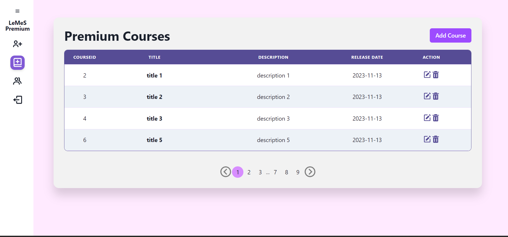

# LeMeS Premium App: The Frontend for LeMeS

## Introduction

Repository ini adalah frontend dari aplikasi LeMeS premium yang digunakan oleh Admin untuk mengelola permintaan request premium dari para pengguna. Selain itu, Teacher juga dapat menggunakan frontend ini untuk mengelola course premium, beserta dengan modul dan materialnya. Apalikasi ini dibuat dengan menggunakan Reat + Typescript. Aplikasi ini dibuat untuk memenuhi tugas besar mata kuliah Pemrograman Aplikasi Berbasis Web.

## Overview Feature

- Chakra UI
- Loading state
- Toast
- HTTP Client with Axios
- Cookie

## Screenshot

### Login Page

### Register Page

### Upgrade Premium Request Page (Admin)

### Premium Course Management Page (Admin)

### Premium User Management Page (Admin)

### Add User (Admin)

### Add Course (Admin)

### Edit User

### Edit Course

### Delete User

### Delete Course

### Upgrade Premium

### Decline Premium

### Cara menjalankan aplikasi

1. Pastikan sudah terinstall NodeJS
2. clone repositori ini
3. Buat file `.env` pada root folder aplikasi mengikuti contoh .env.example
4. Install dependency dengan menjalankan perintah `yarn install`
6. Atau, dalam mode production, `yarn start`

### Pembagian Tugas

1. Frontend Fitur Regsiter & Login: 13521161, 13521164
2. Backend Fitur Register & Login : 13521139
3. Frontend User Premium's table: 13521161
4. Backend  User Premium's table: 13521164
5. Frontend Course Premium's table: 13521161, 13521164
6. Backend  Course Premium's table: 13521161, 13521164
7. Frontend Request Premium's table: 13521164
8. Backend  Request Premium's table: 13521139
9. Frontend Edit Profile : 13521161, 13521164
10. Backend Edit Profile : 13521139
11. Project Setup: 13521139
12. Frontend Fitur Homepage (untuk Teacher) : 13521139, 13521164
13. Backend Fitur Homepage : 13521139, 13521164
14. Frontend Not Found : 13521161
15. Modals and Popus : 13521161, 13521164
